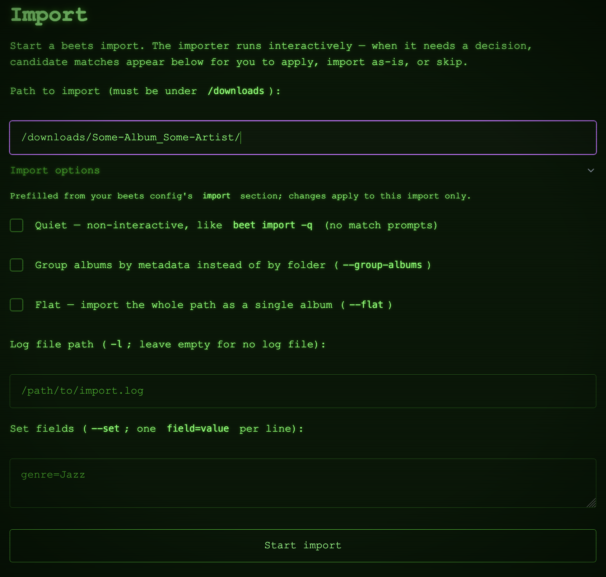
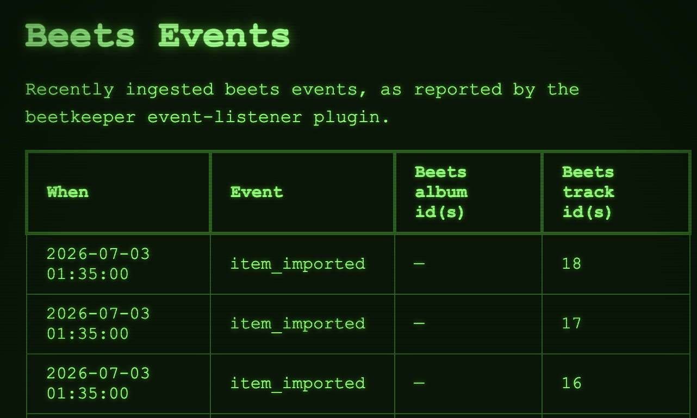
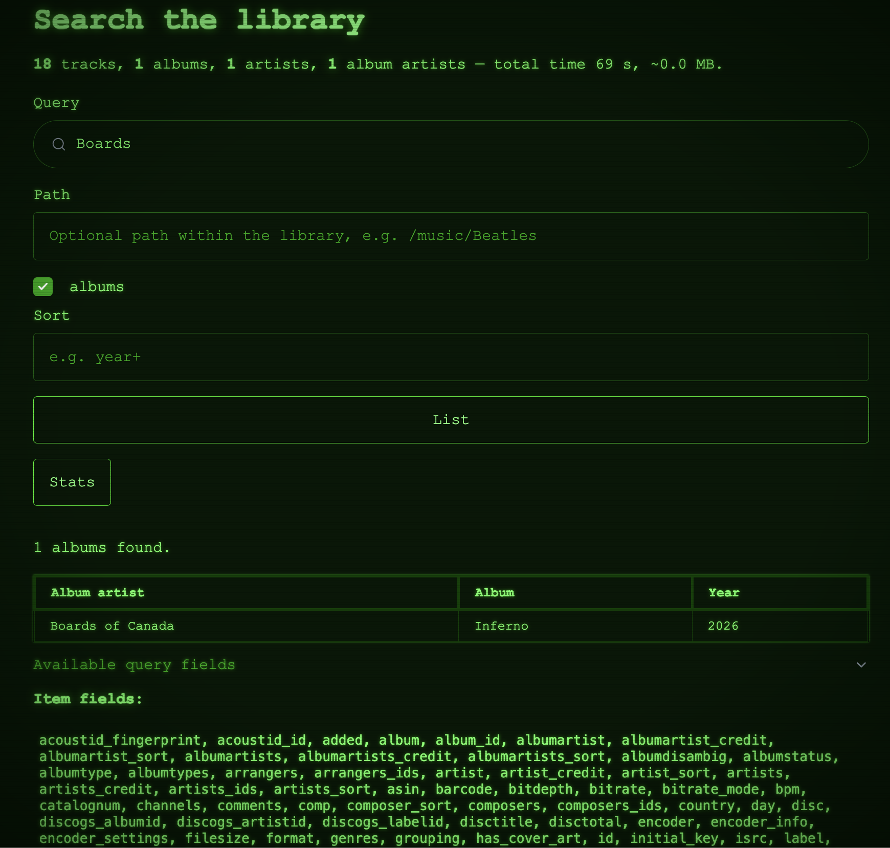

<!--  
beetkeeper: A highly configurable, self-hosted app for beets music library management. Supports both automated and manual workflows.
Copyright (C) 2026 Zach Gottesman

This program is free software: you can redistribute it and/or modify it under the terms of the GNU Affero General Public License as published by the Free Software Foundation, either version 3 of the License, or (at your option) any later version.

This program is distributed in the hope that it will be useful, but WITHOUT ANY WARRANTY; without even the implied warranty of MERCHANTABILITY or FITNESS FOR A PARTICULAR PURPOSE. See the GNU Affero General Public License for more details.

You should have received a copy of the GNU Affero General Public License along with this program. If not, see <https://www.gnu.org/licenses/>.  
-->

# Beetkeeper

[](https://pypi.org/project/beetkeeper/)
[](https://www.python.org)


A self-hosted web app for managing and monitoring [beets](https://beets.io/). Supports both automated and manual beet workflows.

## Features

Not to be confused with the [beets web plugin](https://beets.readthedocs.io/en/v2.5.0/plugins/web.html), `beetkeeper` offers the following features out of the box:

| Feature                                                     | **`beetkeeper`** |    `beets[web]`  |
| :---------------------------------------------------------- |      :---:       |      :---:       |
| Explore current and past `beets` imports                    |  ✅              |  ❌               |
| Supports automated REST API-based imports                   |  ✅              |  ❌               |
| UI supports manually running imports                        |  ✅              |  ❌               |
| Advanced search UI, supports all [query types](https://beets.readthedocs.io/en/v2.5.0/reference/query.html) |  ✅              |  ❌               |
| All UI functionality available via REST API for automation  |  ✅              |  ❌               |
| Async API support                                           |  ✅              |  ❌               |
| Play library audio files in browser                         |  ❌              |  ✅               |

### Web Interface

<table>
	<tr>
	<td><p style="font-size: 1.1rem;">Run multiple imports</p></td><td><br>... and monitor them simultaneously, whether they were initiated manually, or via the backing REST API.</td>
	</tr>
	<tr>
	<td><p style="font-size: 1.1rem;">Automated event tracking</p></td><td><br>... like album / song import completion, file modifications, etc. Maintains the full beets event history whether it was trigger via the UI or the API.</td>
	</tr>
	<tr>
	<td><p style="font-size: 1.1rem;">Search your Beets library</p></td><td><br>... similar to <code>beets[web]</code>, but different</td>
	</tr>
</table>

## Installation

You can install `beetkeeper` either as a pip package, or as a Docker image.

### Docker Installation

The docker container is fairly straightforward. 
You just need to map your host directories to the following container volume paths:

|  Container Volume Path     |  Function                                  |
| :------------------------- |--------------------------------------------|
| `/beets`                   | Persistent beets config file and app data  |
| `/music`                   | Music library (beets-tagged and imported)  |
| `/downloads`               | Raw downloaded music, unprocessed by beets |

Example docker usage is shown below:

Via docker run:

```shell
docker run \
	-v /host/path/to/beets_app_directory:/beets \
	-v /host/path/to/downloads:/data/raw \
	-v /host/path/to/music_library:/data/music \
	-e BEETSDIR=/beets \
	ghcr.io/zach-overflow/beetkeeper
```

Or via docker-compose:

```yaml
services:
  beetkeeper:
    image: ghcr.io/zach-overflow/beetkeeper
    restart: unless-stopped
    ports:
      - "8337:8337"
    environment:
      BEETSDIR: /beets
    volumes:
      - /host/path/to/beets_app_directory:/beets
      - /host/path/to/downloads:/data/raw
      - /host/path/to/music_library:/data/music
```

### PyPI Installation

If you want to run without Docker, you will need to install the server package AND the beets plugin package in the virtualenv where you've installed `beets`:

```shell
pip install beetkeeper beetkeeper-plugin
```

Then, within the same virtualenv, run `beetkeeper --config-path <path to beets config>`

### Configuration

Both methods point beetkeeper at your **beets** config: `BEETSDIR` (the **directory** holding your beets
`config.yaml`, beets' own convention) or `--config-path` (the config file itself). beetkeeper
reads its own settings from an **optional** top-level `beetkeeper` section in that beets config — a plain
beets config without it is still valid for beets. For example:

```yaml
# ... your usual beets config (directory, library, plugins, ...) ...

beetkeeper:
  log_level: INFO
  server:
    hostname: 0.0.0.0
    port: 8337
    server_workers: 2
  database:
    # beetkeeper's own SQLite db (separate from the beets library); created automatically on first run.
    sqlite_path: /beets/beetkeeper.db
```

## Contributing and Development Info

Refer to the [contributor docs](./docs/contributor_docs).

## Releases

Check out the [releases page](https://github.com/zach-overflow/beetkeeper/releases) for more details.

## Bugs Reports / Feature Requests

Feel free to file them on the [issues page](https://github.com/zach-overflow/beetkeeper/issues).
