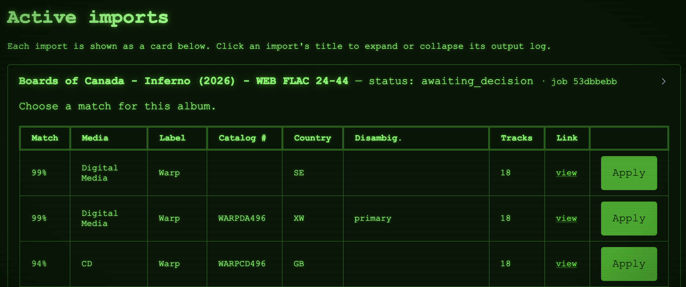
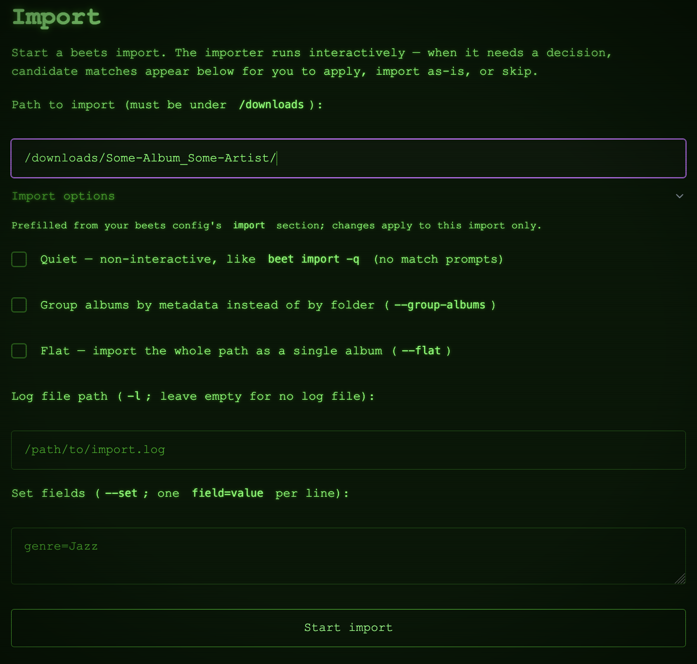
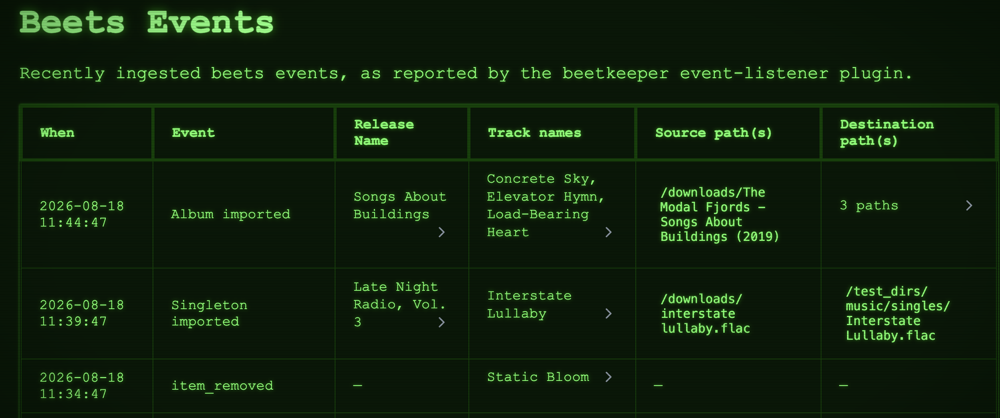
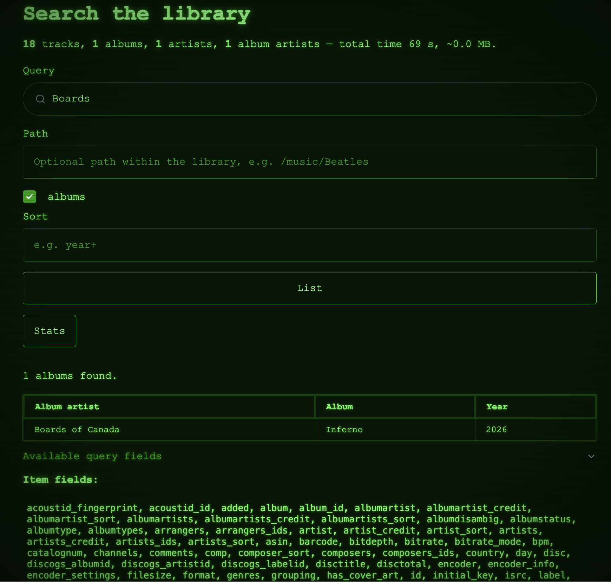

# Using the Web Interface

Once the server is running (see the [Quick Start Demo](demo.md)), open it in your browser at
`http://<hostname>:<port>/` (port `8337` by default). The web UI exposes the same functionality as the
[REST API](rest-api.md).

## Imports

Start imports manually and monitor them — whether triggered from the UI or the API — in real time. When
beets needs a decision (for example, which candidate release to apply), the UI presents the choices.

{ width="80%" }

Multiple imports can run and be monitored simultaneously.

{ width="80%" }

### Reimports

The import page can also [reimport](https://beets.readthedocs.io/en/stable/reference/cli.html#reimporting)
music that is already in your library — the `beet import -L` workflow. Use it to change a match you regret,
to recover tags an earlier import dropped, or to tag music you originally imported as-is. Library entries are
replaced in place (never duplicated), and beets preserves their flexible attributes and added-date.

Select what to reimport with a [beets query](https://beets.readthedocs.io/en/stable/reference/query.html)
(each album and standalone track on the search page links straight to its own reimport), and use **Preview
matches** to check what the query covers before starting. An empty query means the whole library, so it
additionally requires ticking **Reimport the entire library**. The reimport options are:

- **Move files to match the new tags** — untick to retag in place and leave every file where it is
  (`beet import -C -M`); handy when a player or music server gets confused by a path and tags changing at
  once. You can run `beet move` later.
- **Write the new tags to the files** — untick to update only the beets database (`-W`).
- **Singletons** — match standalone tracks instead of albums (`-s`). Tracks that belong to an album are
  skipped, because beets would detach them from it.

When a reimport finishes, its card shows a **before/after diff** of every reimported album: changes shared
by all tracks, per-track changes, fields whose previous **value was lost**, and tracks the chosen match did
not cover. Library entries whose files no longer exist on disk are never touched; they are listed separately
so you can restore the files or remove the entries.

## Events

Browse the full history of beets events — album/track import completion, file modifications, and removals.
The history stays complete whether an event originated in the UI, the API, or from beets operations run
elsewhere (via the [beets plugin](./installation.md)).

{ width="80%" }

## Search

Query your beets library using the full
[beets query language](https://beets.readthedocs.io/en/stable/reference/query.html) — the same expressive
queries you use on the beets command line.

{ width="80%" }
