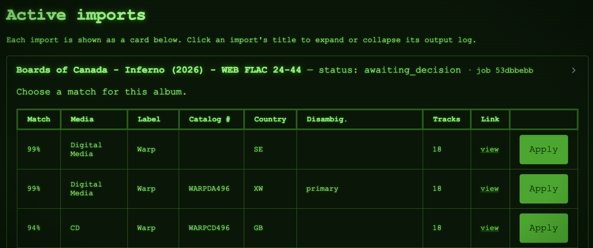
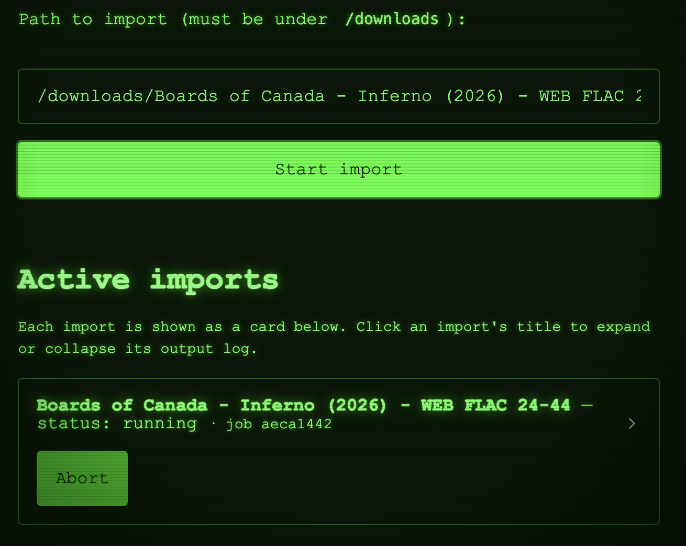
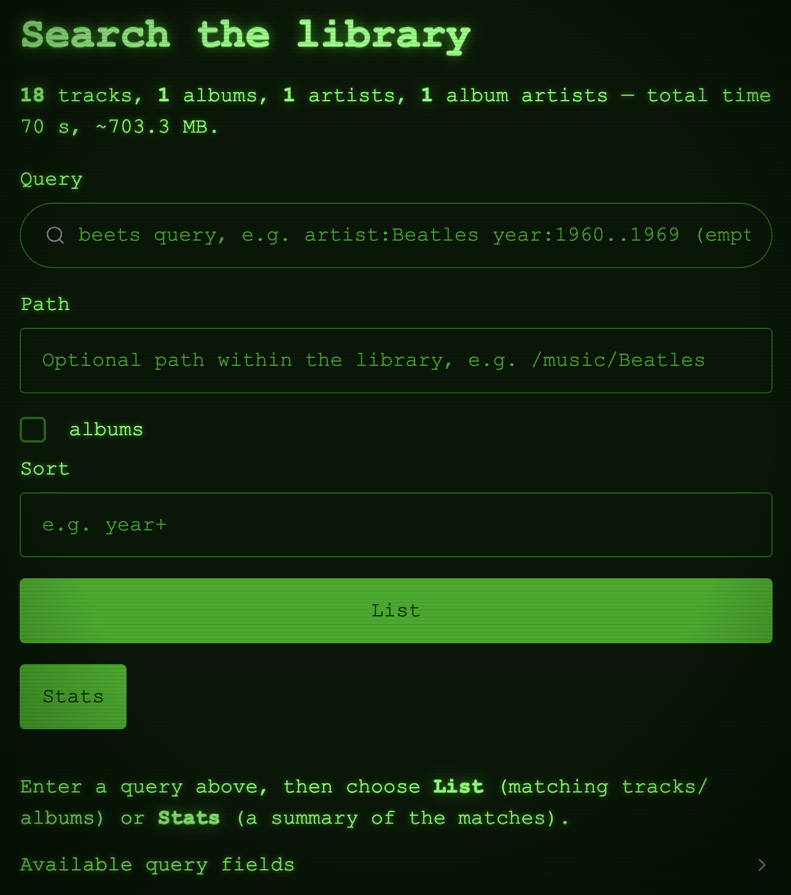

# Using the Web Interface

Once the server is running (see the [Quick Start Demo](quickstart.md)), open it in your browser at
`http://<hostname>:<port>/` (port `8337` by default). The web UI exposes the same functionality as the
[REST API](rest-api.md).

## Imports

Start imports manually and monitor them — whether triggered from the UI or the API — in real time. When
beets needs a decision (for example, which candidate release to apply), the UI presents the choices.

{ width="80%" }

Multiple imports can run and be monitored simultaneously.

{ width="80%" }

## Events

Browse the full history of beets events — album/track import completion, file modifications, and removals.
The history stays complete whether an event originated in the UI, the API, or from beets operations run
elsewhere (via the [beets plugin](../installation.md)).

{ width="80%" }

## Search

Query your beets library using the full
[beets query language](https://beets.readthedocs.io/en/stable/reference/query.html) — the same expressive
queries you use on the beets command line.

{ width="80%" }
